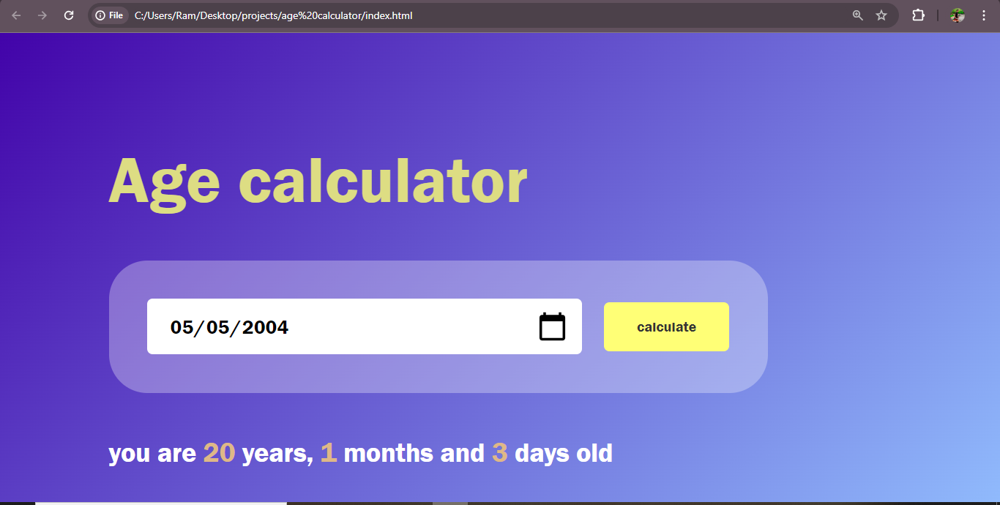

<h1> Age calculator </h1>
<h3>summary </h3>

An age calculator created using HTML and CSS is a simple, user-friendly web application that calculates a person’s age based on their date of birth. The interface typically includes an input field where the user can select or enter their date of birth, along with a button to calculate their age. HTML is used to structure the input elements and display the calculated result on the webpage, while CSS is applied to style the layout, making it visually appealing and easy to use. The CSS can add color, spacing, and alignment to ensure a clean and attractive design. With basic styling and clear instructions, this age calculator provides an accessible way for users to quickly determine their current age without the need for complex computations.

## Key Features:
- Easy-to-use interface for entering the date of birth and obtaining the current age.
- Accurate age calculation, accounting for leap years and other relevant factors.
- Flexibility to integrate the age calculation functionality into other applications or use it as a standalone tool.
- Support for multiple programming languages, enabling easy adoption and customization.
- Extensive documentation and code samples to assist developers in understanding and utilizing the age calculation functionality.

